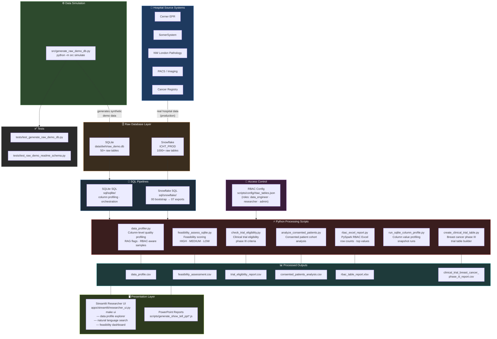

# data_champs
Imperial College Healthcare NHS Trust

## Architecture



## End-to-End Data Flow

```mermaid
flowchart LR
    %% ── Step 1: Ingest ──────────────────────────────────────────────
    subgraph INGEST["1 · Ingest / Simulate"]
        direction TB
        I1(["🏥 Hospital EMR\n& Registry Systems"])
        I2(["⚙️ Synthetic Generator\npython -m src simulate"])
        I1 -->|production path| I1OUT[("Snowflake\nICHT_PROD\n1000+ raw tables")]
        I2 -->|demo / dev path| I2OUT[("SQLite\nraw_demo.db\n50+ raw tables")]
    end

    %% ── Step 2: Discover ────────────────────────────────────────────
    subgraph DISCOVER["2 · Metadata Discovery"]
        direction TB
        D1["Schema scan\nsql/snowflake/02_metadata_discovery.sql\nINFORMATION_SCHEMA sweep"]
        D2["Column value profile\nscripts/run_sqlite_column_profile.py\nsql/sqllite/01_column_value_profiler.sql"]
        D3["RBAC gate\nscripts/config/rbac_tables.json\nroles: data_engineer · researcher · admin"]
    end

    %% ── Step 3: Profile ─────────────────────────────────────────────
    subgraph PROFILE["3 · Data Quality Profiling"]
        direction TB
        PQ1["Column quality flags\nscripts/data_profiler.py  profile\nGREEN ≥90% · AMBER ≥50% · RED <50%"]
        PQ2["Snowflake quality scan\nsql/snowflake/03_quality_profile.sql\nnull rate · distinct count · min/max"]
    end

    %% ── Step 4: Assess ──────────────────────────────────────────────
    subgraph ASSESS["4 · Feasibility Assessment"]
        direction TB
        FA1["Metadata-first triage\ndata_profiler.py  assess --metadata-only\nconcept → column matching"]
        FA2["Full feasibility score\nfeasibility_assess_sqlite.py\nHIGH · MEDIUM · LOW · UNKNOWN"]
        FA3["Snowflake scoring\nsql/snowflake/04_feasibility_scoring.sql\nRAG score per data point"]
    end

    %% ── Step 5: Clinical Curation ───────────────────────────────────
    subgraph CURATE["5 · Clinical Curation"]
        direction TB
        CC1["Trial eligibility check\nscripts/check_trial_eligibility.py\nphase III inclusion / exclusion criteria"]
        CC2["Consented cohort analysis\nscripts/analyze_consented_patients.py\nICF-confirmed patient set"]
        CC3["Clinical trial table builder\nscripts/create_clinical_trial_table.py\nbreast cancer phase III extract"]
    end

    %% ── Step 6: Access & Govern ─────────────────────────────────────
    subgraph GOVERN["6 · Governance & Access Report"]
        direction TB
        GV1["RBAC Excel report\nscripts/rbac_excel_report.py  PySpark\nrow counts · top values · access status"]
        GV2["Snowflake dashboard views\nsql/snowflake/05_dashboard_views.sql\nSnowsight-ready outputs"]
        GV3["Policy checks\nBlocked identifiers: subject · encntr_id · episode_id\nAllowed DB: icht_prod only"]
    end

    %% ── Step 7: Serve ───────────────────────────────────────────────
    subgraph SERVE["7 · Researcher Outputs"]
        direction TB
        SV1["Streamlit UI\nmake ui\nProfile explorer · NL search · Feasibility dashboard"]
        SV2["CSV / Excel artefacts\ndata/processed/\nfeasibility · eligibility · cohort · profile"]
        SV3["PowerPoint slide deck\nscripts/generate_show_tell_ppt*.js\nauto-generated show-and-tell deck"]
    end

    %% ── Step 8: Test & Validate ─────────────────────────────────────
    subgraph VALIDATE["8 · Test & Validate"]
        direction TB
        TV1["Schema contract tests\ntests/test_raw_demo_readme_schema.py"]
        TV2["DB generation tests\ntests/test_generate_raw_demo_db.py"]
        TV3["make test"]
    end

    %% ── Flow connections ────────────────────────────────────────────
    INGEST --> DISCOVER
    DISCOVER --> PROFILE
    PROFILE --> ASSESS
    ASSESS --> CURATE
    CURATE --> GOVERN
    GOVERN --> SERVE
    INGEST -.->|"CI gate"| VALIDATE

    %% ── Styles ──────────────────────────────────────────────────────
    style INGEST   fill:#1e3a5f,color:#fff,stroke:#4a90d9
    style DISCOVER fill:#2d3a1e,color:#fff,stroke:#8ec42a
    style PROFILE  fill:#3a2d1e,color:#fff,stroke:#c47a2a
    style ASSESS   fill:#3a1e3a,color:#fff,stroke:#9e5ac4
    style CURATE   fill:#1e2d3a,color:#fff,stroke:#2a7ac4
    style GOVERN   fill:#3a1e1e,color:#fff,stroke:#c42a2a
    style SERVE    fill:#1e3a3a,color:#fff,stroke:#2ac4c4
    style VALIDATE fill:#2a2a2a,color:#fff,stroke:#888888
```



Fresh clone setup:
- see [docs/SETUP.md](/Users/macbookpro/Documents/_dev2/data_champs/docs/SETUP.md)
- quickest macOS/Linux path: `make setup && make ui`

## Setup

This project uses Python dependencies listed in `requirements.txt`.

### Windows (PowerShell, recommended)

Run:

```powershell
.\scripts\install_windows.ps1
```

### Using `make` (recommended for macOS/Linux)

Run:

```bash
make setup
```

This one command:
- creates or reuses `.venv`
- installs Python dependencies
- installs Java 17 locally if needed
- downloads the SQLite JDBC jar for PySpark
- generates `data/dwh/raw_demo.db`

For a clean-machine walkthrough and troubleshooting, see [docs/SETUP.md](/Users/macbookpro/Documents/_dev2/data_champs/docs/SETUP.md).

## CLI entrypoint

The application entrypoint is:

```bash
python -m src simulate
```

Right now the CLI supports source database generation. This is the command we should extend later for the full pipeline, for example when we add extract, transform, load, and orchestration steps.

## Generate the raw source database

Create the synthetic source SQLite database:

```bash
python -m src simulate
```

This generates `data/dwh/raw_demo.db` with the expected raw source tables and data.

You can also use:

```bash
make simulate
```

## Inspect the raw source database

```bash
python scripts/inspect_raw_demo_db.py
```

Optionally point it at a different database:

```bash
python scripts/inspect_raw_demo_db.py --db data/dwh/raw_demo.db
```

Or via Make:

```bash
make inspect-db
```

## Check documented schema against the database

Validate that the schema documented in `docs/raw_demo_database_readme.md` exists in the source database:

```bash
python scripts/check_raw_demo_readme_schema.py
```

Or via Make:

```bash
make check-readme-schema
```

## Run automated tests

Run the source database generation and documented-schema test suite:

```bash
python -m unittest tests.test_generate_raw_demo_db tests.test_raw_demo_readme_schema
```

Or via Make:

```bash
make test
```

## Streamlit app

Launch the researcher UI:

```bash
make ui
```

If you want to run Streamlit directly instead, make sure `make setup` has already completed and use:

```bash
.venv/bin/python -m streamlit run apps/streamlit/researcher_ui.py -- --config scripts/config/rbac_tables.example.json
```

If you are starting from a fresh clone, run `make setup` first.

## PySpark RBAC Excel Report

Generate an Excel report with:
- Table name
- Row count
- Population percentage for a chosen value column
- Access status based on RBAC
- Top 5 values when allowed
- Permission request guidance when not allowed

### Files
- `scripts/rbac_excel_report.py`
- `scripts/config/rbac_tables.example.json`

### Install

```bash
pip install pyspark openpyxl
```

### Run

```bash
python scripts/rbac_excel_report.py \
	--config scripts/config/rbac_tables.example.json \
	--role analyst \
	--output data/processed/rbac_table_report.xlsx
```

### Notes
- The script uses PySpark DataFrames (lazy execution).
- It uses generators and write-only Excel output to keep memory usage low.
- If `anon_access_all_models` is enabled in config, users without full access can still see anonymized top values.

## Governance Query Guidelines

The following identifier columns are restricted by policy and must not be requested in reports or prompts:
- `subject`
- `encntr_id`
- `episode_id`

If requested, the system should block the request and suggest using non-identifying aggregated fields.

Only one database is allowed for search operations:
- `icht_prod`

If a table config points to any other database, the system marks it as policy blocked.

## Data Profiler

Column-level data quality profiling with RBAC-aware sample suppression and color-coded quality flags.

### Role behavior

| Role | Table/column names | Population stats | Quality flag | Sample values |
|---|---|---|---|---|
| `data_engineer` | Yes | Yes | Yes | Yes (top 5 distinct) |
| `researcher` | Yes | Yes | Yes | **Suppressed** |
| `admin` | Yes | Yes | Yes | Yes |

### Quality color codes

- **GREEN** — populated >= 90%
- **AMBER** — populated >= 50%
- **RED** — populated < 50%

### Run profile

```bash
# Data engineer sees full profile with samples
python scripts/data_profiler.py profile \
  --config scripts/config/rbac_tables.example.json \
  --role data_engineer \
  --output data/processed/data_profile.csv

# Researcher sees table/column/population but no sample values
python scripts/data_profiler.py profile \
  --config scripts/config/rbac_tables.example.json \
  --role researcher \
  --output data/processed/data_profile_researcher.csv
```

### Natural language search

Describe in plain English what data you need. Results are scoped to models you have access to.

```bash
python scripts/data_profiler.py search \
  --config scripts/config/rbac_tables.example.json \
  --role data_engineer \
  --query "smoking history and treatment outcomes" \
  --output data/processed/search_results.csv
```

## Feasibility assessment across 1000+ tables

Assess whether requested data points are likely available and usable at scale.

- Uses metadata-first matching (column names + descriptions) for speed.
- Computes population stats only for matched columns.
- Supports `--metadata-only` mode for fastest initial triage.

```bash
# Fast metadata-only triage
python scripts/data_profiler.py assess \
  --config scripts/config/rbac_tables.example.json \
  --role researcher \
  --data-points "smoking status, treatment response, overall survival" \
  --metadata-only \
  --output data/processed/feasibility_assessment_metadata.csv

# Full feasibility with population percentages on matched columns
python scripts/data_profiler.py assess \
  --config scripts/config/rbac_tables.example.json \
  --role data_engineer \
  --data-points "smoking status, treatment response, overall survival" \
  --min-score 1.2 \
  --max-cols-per-table 8 \
  --output data/processed/feasibility_assessment.csv
```

Output columns:
- `model_name`, `table_name`
- `data_point`, `matched_column`, `data_type`, `relevance_score`
- `access_status` (`ACCESS_GRANTED` or `NO_ACCESS`)
- `row_count`, `non_null_count`, `populated_pct`
- `feasibility_flag` (`HIGH`, `MEDIUM`, `LOW`, `UNKNOWN`)
- `notes`

## Snowflake SQL-only feasibility workflow

For Snowflake environments with SQL-only tooling and INFORMATION_SCHEMA access, use the runbook in:

- `docs/snowflake_sql_feasibility_workflow.md`

SQL artifacts are in:

- `sql/snowflake/00_bootstrap.sql`
- `sql/snowflake/01_setup.sql`
- `sql/snowflake/02_metadata_discovery.sql`
- `sql/snowflake/03_quality_profile.sql`
- `sql/snowflake/04_feasibility_scoring.sql`
- `sql/snowflake/05_dashboard_views.sql`
- `sql/snowflake/06_run_all.sql`
- `sql/snowflake/07_exports.sql`
- `sql/snowflake/08_mock_feasibility_database.sql`
